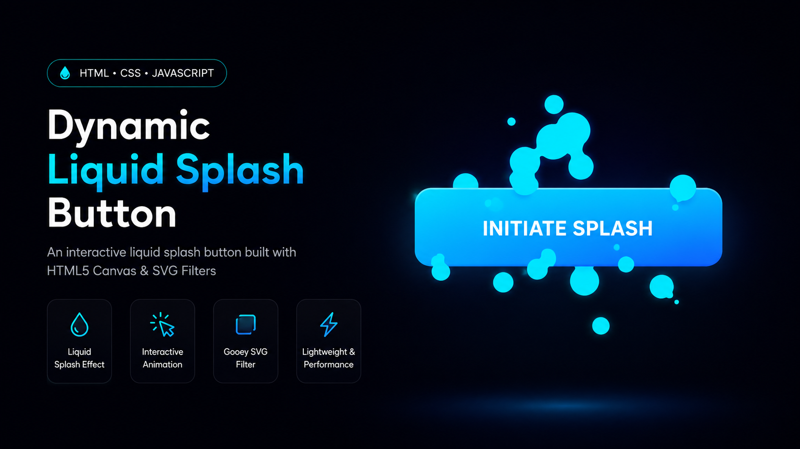

# 💧 Dynamic Gooey Liquid Splash Button

An interactive **Liquid Splash Button** built with **HTML, CSS, JavaScript, HTML5 Canvas, and SVG Gooey Filters**. Click the button to generate smooth liquid splash particles with a modern gooey animation effect.



---

## ✨ Features

- 💧 Dynamic liquid splash animation
- 🎨 SVG Gooey Filter effect
- ⚡ HTML5 Canvas rendering
- 🖱️ Interactive click-based particle system
- 📱 Responsive layout
- 🚀 Lightweight and dependency-free
- 🎯 Pure HTML, CSS & JavaScript

---

## 🛠️ Technologies Used

- HTML5
- CSS3
- JavaScript (ES6)
- HTML5 Canvas API
- SVG Filters

---

## 📂 Project Structure

```
Dynamic-Gooey-Liquid-Splash-Button/
│
├── index.html
├── style.css
├── script.js
├── preview.png
└── README.md
```

---

## 🚀 Getting Started

### Clone the Repository

```bash
git clone https://github.com/YOUR_USERNAME/YOUR_REPOSITORY.git
```

### Open the Project

Simply open **index.html** in your browser.

Or use **Live Server** in Visual Studio Code.

---

## 🎮 How It Works

- Click anywhere on the button.
- Multiple liquid particles are generated.
- Particles spread outward with random velocity.
- SVG Gooey Filter merges nearby particles into a smooth liquid effect.
- Particles gradually shrink and disappear.

---

## 📸 Preview


---

## 💡 Future Improvements

- Hover splash animation
- Multiple color themes
- Ripple effect
- Sound effects
- Touch support
- Custom particle colors
- Adjustable splash intensity

---

## ⭐ Support

If you like this project, consider giving it a **⭐ Star** on GitHub.

---

## 📺 YouTube

Watch the tutorial on YouTube.

https://www.youtube.com/@DesignAndMedia-DM

---

## 👨‍💻 Author

**Tinesh Chasiya**

GitHub:
https://github.com/TineshChasiya

YouTube:
https://www.youtube.com/@DesignAndMedia-DM

Portfolio:
https://design-media.netlify.app

---

## 📄 License

Feel free to use and modify it for personal and commercial projects.